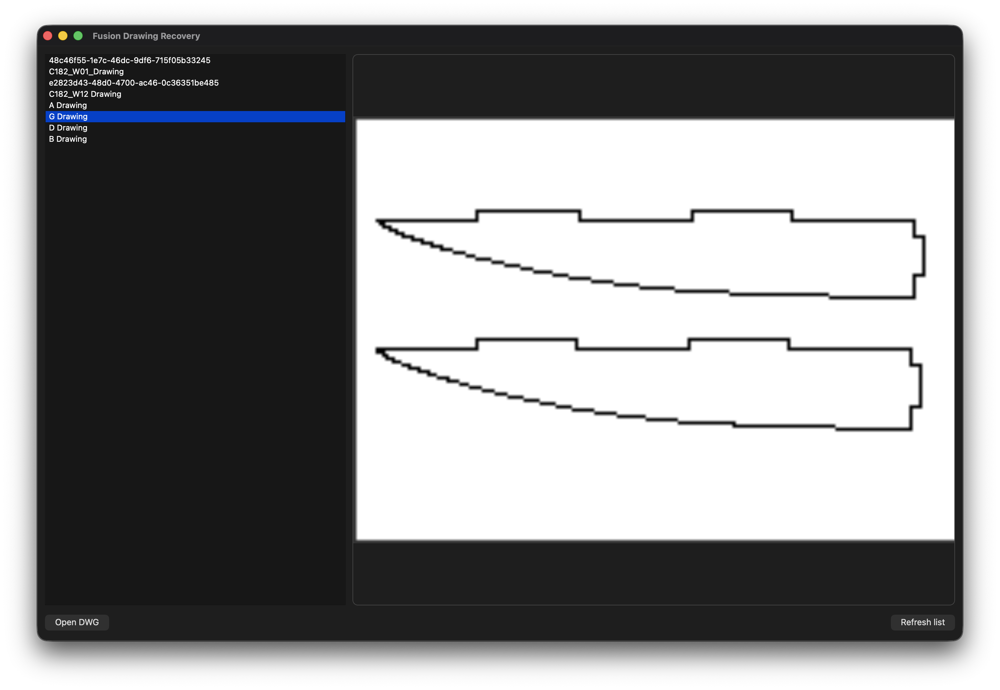

# Fusion Drawing Recovery
Fusion Drawing files are standard ZIP archives.

So.. This app recovers DWG drawings directly from Autodesk Fusion 360 .f2d files.

Fusion Drawing Recovery is a lightweight desktop utility that scans local Fusion 360 storage, previews technical drawings, and extracts the original DWG files embedded inside Fusion Drawing archives.

No Fusion export workflow required.

---

## Screenshot

---

## Features

- Automatically discover local Fusion Drawing files (.f2d)
- Preview sheet thumbnails without opening Fusion 360
- Recover embedded DWG files
- Clean Autodesk GUID clutter from filenames
- Sort drawings by modification date
- Fast local workflow with no cloud dependency

---

## Why?

Fusion Drawing files already contain the data needed to recover technical drawings, including thumbnails and embedded DWG files.

This tool provides a simple way to browse those drawings and extract the original DWG content stored locally on your machine.

---

## How It Works

Fusion Drawing files (.f2d) are standard ZIP archives.

A typical archive contains:

text Drawing.f2d │ ├── SheetThumbnails/ │   └── D3_large.png │ └── Dwg.BlobParts/     └── ExtFile.xxxxx.dwg 

Fusion Drawing Recovery reads these archives directly and extracts the embedded DWG content.

---

## Requirements

- Python 3.11+
- PySide6
- Pillow

Install dependencies:

bash pip install -r requirements.txt 

---

## Run

bash python main.py 

Or launch directly from VS Code using F5.

---

## Project Structure

text fusion_drawing_recovery/  ├── assents/ │   └── main.png  ├── core/ ├── ui/ ├── output/  ├── main.py ├── requirements.txt └── README.md 

---

## Current Functionality

- Drawing discovery
- Thumbnail extraction
- DWG extraction
- Drawing preview
- Refresh workflow
- PySide6 desktop interface

---

## Roadmap

- Batch DWG export
- PDF workflow
- SVG export
- Search and filtering
- Drawing metadata viewer
- Improved CAD integration

---

## Disclaimer

This application does not modify Autodesk Fusion files.

It only reads data already stored locally on the user's machine and extracts assets already embedded inside Fusion Drawing archives.
